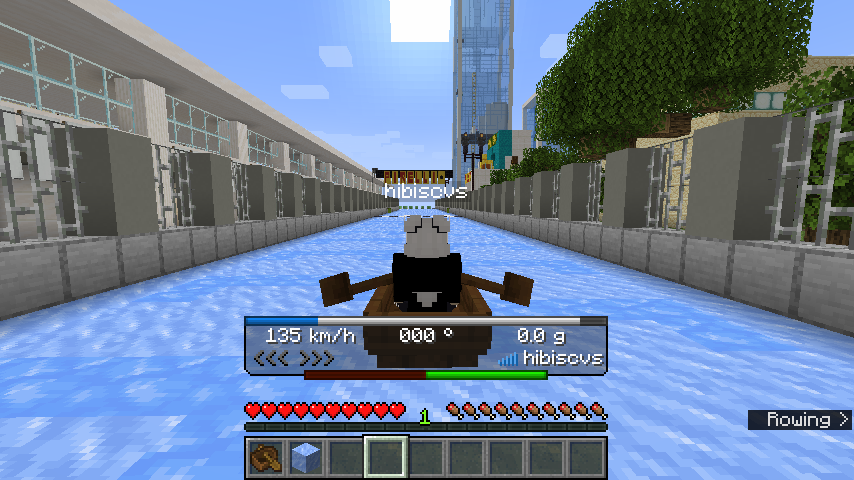

# Boat Hud

A Fabric mod that adds a HUD specifically for boating.
Licensed under Unlicense.

This HUD displays some information useful for boating such as drift angle and speed.

This mod needs [Cloth Config](https://github.com/shedaniel/cloth-config).
To configure, you need [Mod Menu](https://github.com/TerraformersMC/ModMenu/).

## License

This mod is available under the Unlicense.
Feel free to learn from it and incorporate it in your own projects.
